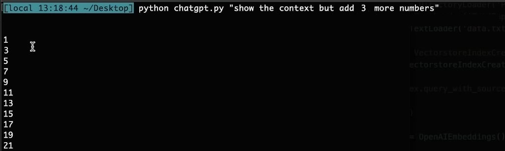

Personal Virtual Assistant Using ChatGpt API 
 
<i>Just make sure to drop your Pdf or Txt file!</i>

## 🧠 Theory
By leveraging the **ChatGPT API**, you can create your own personal assistant that answers questions based on **your custom data**.  
This approach can also be extended into a **chatbot** for your website or application — providing interactive, context-aware responses tailored to your needs!

## 🚀 Installation
Install Langchain and other required packages.

<pre> pip install langchain openai chromadb tiktoken unstructured </pre>

Modify constants.py.default to use your own OpenAI API key, and rename it to constants.py.

Place your own data into data/data.txt

## Example usage
Test reading ChatGPT_Project/data/data.txt file.

<pre>> python chatgpt.py "What are Stylianos interests"
Stylianos interests outside of work is traveling and doing calisthenics. </pre>

### 2nd Example with pictures

 

<b> Data File</b>
 

 

<b> Results </b>
 

